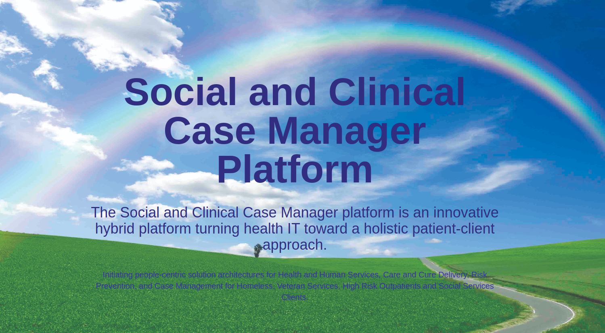

# Life Coach - Case Manager Platform

The Social and Clinical Case Manager platform is an innovative hybrid platform turning health IT toward a holistic patient-client approach.The case manager platform is built to assist clinical and social services case managers with care providers directives g and coordinating client interactions to drive better client and patient outcomes.

---



---

## Platform Components

- Clients
  - Assessments
  - Case Plan
  - Interactions
  - Program Partners
  - Family
  - Reentry Program
- Workers
- Program Managers/Administrators
- Workforce Development
- Client History - Employement & Education, Medical, Criminal,

### Tech Stack

- Next JS
- React JS
- TypeScript
- React Hook Form
- Neon DB
- Drizzle
- Zod
- TailwindCSS
- ShadCN-UI
- Kinde

### Dev Notes

May need to use `--legacy-peer-deps flag`

**_package.json_**

// Sentry not quite ready for TurboPack

Replace this line of code

```
"dev": "next dev --turbopack",
```

with

```
   "dev": "next dev",
```

First, run the development server:

```bash
npm run dev
# or
yarn dev
# or
pnpm dev
# or
bun dev
```

Open [http://localhost:3000](http://localhost:3000) with your browser to see the result.
